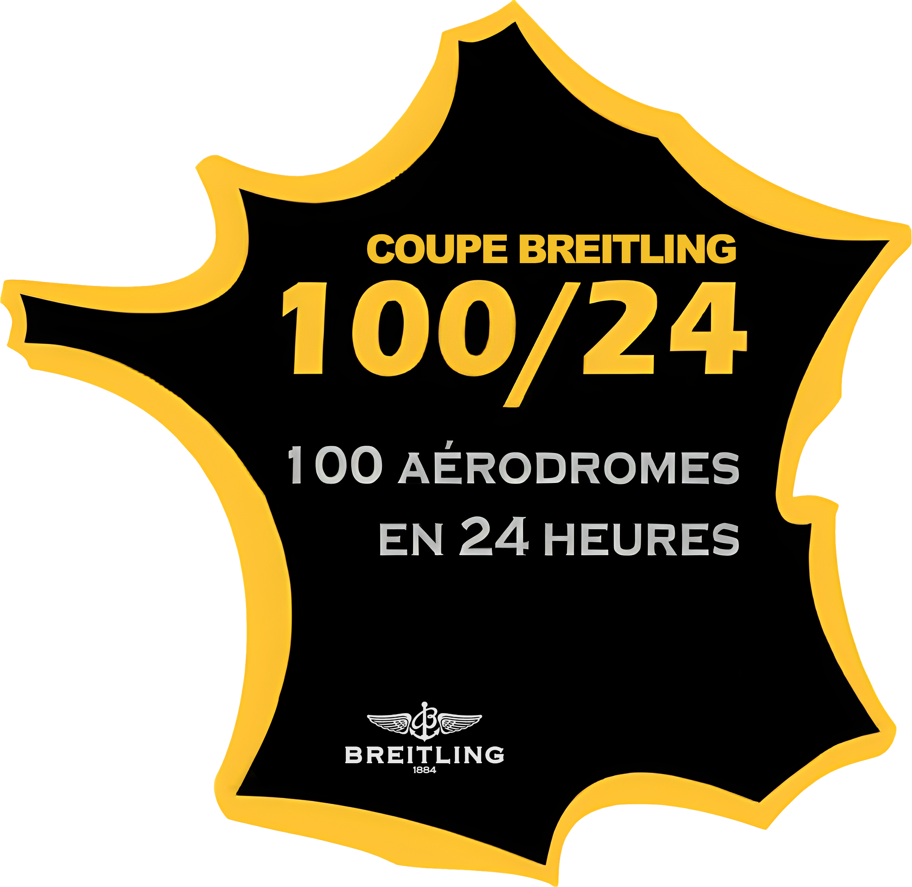

# FlightPath
*Projet collectif du semestre 8 (2023)*

 

L'objectif de ce projet était de faire une application permettant de résoudre 2 problèmes :
* **Problème du voyageur de commerce (TSP)** \
  Étant donné un ensemble d'aérodromes donné, déterminer le plus court chemin passant par chaque ville une et une seule fois.
  

  
* **Coupe Breitling** \
  Déterminer un chemin passant par au moins 100 aérodromes dont au moins un dans chaque zone (Nord-Est, Nord-Ouest, Sud-Est, Sud-Ouest) tout en ayant un temps de trajet inférieur à 24 heures. \
  Les zones sont délimitées par des parallèles/méridiens et la consommation de l'avion ainsi que les restrictions d'accès jour/nuit doivent être pris en compte dans l'algorithme.
  

## Installation
Le projet `Interface_Graphique/` peut être ouvert directement avec Qt (version 6.1 testée), le dossier `Interface_Graphique/Solver/` peut être ouvert avec visual studio et contient les différents solveurs et le coeur de l'application.

## Solveurs

  

    <b>Voyageur de commerce - PPV</b>
  

  Ce solveur utilise un l'algorithme du <b>Plus Proche Voisin (PPV)</b> en <b>Multistart</b> suivi d'un algorithme d'optimisation local <b>k-opt</b> (k = 0, 2 ou 3). Ce solveur est <b>multithreadé</b> et le nombre de threads peut être réglé dans l'interface.

  

    <b>Coupe Breitling - Naturel</b>
  

  

    <b>Coupe Breitling - Label Setting</b>
  

  

    <b>Coupe Breitling - Construction/Optimisation</b>
  

## Export
### Fiche de vol
Un fiche de vol au format `.xlsx` peut être exportée à partir d'un chemin. \
Elle contient les informations suivantes :
* Le code OACI des différentes étapes du trajet
* Le nom des aérodromes
* Une case vide pour remplir l'altitude
* Le cap vers la prochaine étape
* La distance avant la prochaine étape
* Une case vide remplir le temps avant la prochaine étape

### Carte
Afin de pouvoir visualiser le trajet, une carte au format `.kml` peut être exportée. \
Pour afficher la carte :
* Rendez-vous sur [MyMaps](https://mymaps.google.com)
* Créez une nouvelle carte
* Importez le fichier `.kml`

Par défaut toutes les stations sont affichées ainsi que le chemin trouvé. \
Pour la coupe breitling, les stations accessibles de nuit et celles avec des pompes à essence peuvent être affichées. 
 

Vous pouvez masquer les différents calques avec les boutons à gauche.

## Dépendances

* [Qt](https://www.qt.io/product/qt6)
* [OpenXLSX](https://github.com/troldal/OpenXLSX)
